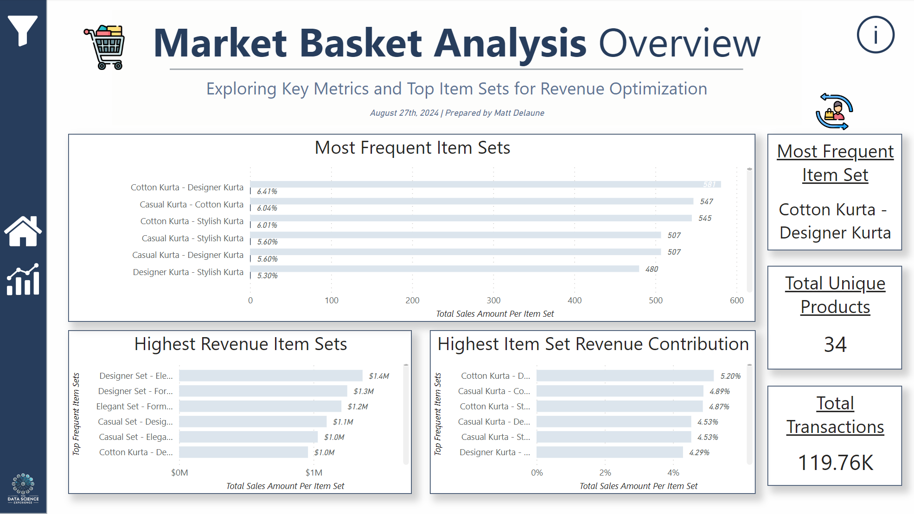
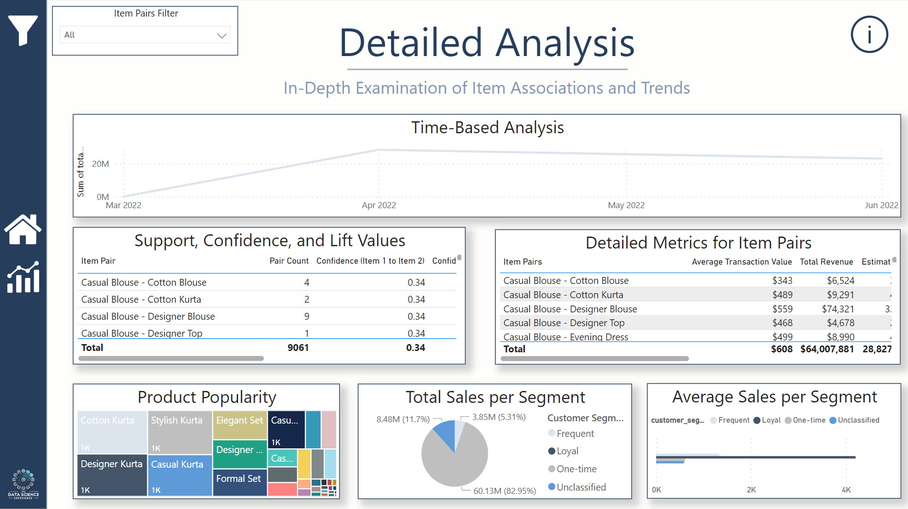
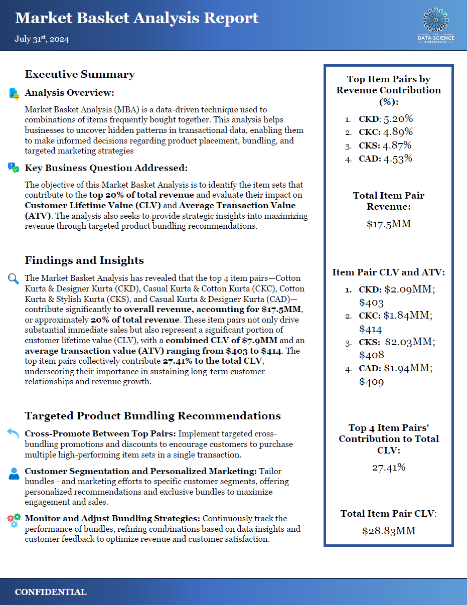

# Ecommerce Market Basket Analysis and Power BI Dashboard

## Executive Overview
This project utilizes a comprehensive e-commerce sales dataset to conduct a Market Basket Analysis (MBA) aimed at identifying key product combinations that drive revenue and optimizing cross-selling strategies. The analysis began with the creation of a PostgreSQL database, where data was meticulously cleaned, manipulated, and loaded. Additional steps included augmenting the data with randomly generated product names, optimizing database structure through table dissection, and performing feature engineering to enhance the analysis. The final report and interactive Power BI dashboard offer actionable insights and clear recommendations, demonstrating advanced data processing, analysis, and visualization skills. This project showcases a strong capability to turn complex datasets into strategic business value.

## Table of Contents
- [Technologies Used](#technologies-used)
- [Data Source](#data-source)
- [Features](#features)
- [Business Question](#business-question)
- [Methodology](#methodology)
- [Process](#process)
- [Insights and Recommendations](#insights-and-recommendations)
- [Recommendations for Further Analysis](#future-work)
- [Contact](#contact)
- [Screenshots](#screenshots)

## Technologies Used
- **Kaggle API:** Data collection using Kaggle API
- **Anaconda Prompt:** Environment setup, directory creation, data extraction using Kaggle API, and command-line interface for Git operations.
- **PostgreSQL (psql):** Database and user creation, data storage, and querying.
- **Jupyter Notebooks and Libraries/Packages:** Step-by-step documentation, data cleaning, and analysis.
	- **Python Pandas:** Data cleaning and manipulation. 
	- **Numpy:** Numerical operations and data manipulation.
	- **SQL Magic:** Data integrity verification, feature engineering, exploratory data analysis, and MBA calculations.
	- **SQLAlchemy Engine**: PostgreSQL connection.
	- **Random**: Augmenting data by generating fictional product names.
- **VSCode:** Writing scripts and SQL queries.
- **Power BI:** Visualization and interactive dashboard creation.
- **Git:** Version control for tracking changes, managing project history, and pushing the project directory to GitHub.
- **Word/Google Docs:** Final report compilation and formatting.

**SQL Skills Demonstrated:**
- Temp Tables
- CTEs for Modular Queries
- Complex Joins
- Window Functions
- Subqueries and nested queries
- Aggregation and Grouping
- Data Integrity Checks

## Data Source
[This](https://www.kaggle.com/datasets/thedevastator/unlock-profits-with-e-commerce-sales-data) dataset, sourced from Kaggle, provides a detailed look into e-commerce sales transactions, encompassing order details, product attributes, customer demographics, and purchase history. The dataset is designed to facilitate the exploration of purchasing patterns and profitability drivers within an e-commerce context.

## Features
- **Data Preparation:** Comprehensive data cleaning, manipulation, and augmentation, including the generation of random names based on SKU codes and the optimization of database structure through table dissection and feature engineering.
- **Market Basket Analysis:** In-depth examination of product combinations frequently purchased together, providing insights into customer buying patterns and opportunities for cross-selling and upselling.
- **Sales Trend Analysis and Product Affinity:** Identification of key sales trends over time, including seasonality and product performance, to inform inventory management and promotional planning.
- **Interactive Dashboard:** A Power BI dashboard offering dynamic visualizations allowing stakeholders to explore real-time sales data and insights, fostering data-driven decision-making.
- **Actionable Insights:** Clear, data-driven recommendations for improving sales performance and customer satisfaction based on the analysis of buying patterns and product affinities.
- **Comprehensive Reporting:** A final report detailing the analysis process, findings, and strategic recommendations, showcasing the ability to communicate complex data insights to business stakeholders effectively.

## Business Question

**"How can we identify the item sets that contribute to the top 20% of total revenue and evaluate their impact on Customer Lifetime Value (CLV) and Average Transaction Value (ATV)? Additionally, what strategic insights can we gain to maximize revenue through targeted product bundling recommendations?"**

## Methodology

Market Basket Analysis (MBA) is a data mining technique used to identify associations and relationships between items within large datasets of transactional data. This analysis uncovers patterns that indicate which products are frequently bought together, providing valuable insights into customer purchasing behavior. By examining these associations, businesses can optimize product placements, enhance cross-selling strategies, and design effective marketing campaigns.

In our MBA, we focused on calculating key metrics such as support, confidence, and lift for item pairs. **Support** measures the frequency of occurrence of an item set in the dataset, indicating how often items are purchased together. **Confidence** measures the likelihood of item B being purchased when item A is purchased, providing insight into conditional probabilities. **Lift** evaluates the strength of an association by comparing the observed frequency of item pairs with their expected frequency if they were independent, helping identify strong and potentially profitable associations.

## Process

1. **Environment Setup:** Created a conda environment (env file available in the repository).
2. **Data Collection:** Imported dataset using Kaggle API.
3. **Database Setup:** Set up PostgreSQL and created database schema using the create_tables.sql script.
4. **Data Cleaning and Manipulation:** Cleaned and manipulated data for database import using data_cleaning.ipynb.
5. **Data Augmentation:** Generated fictional product names using fictional_product_name_generation.ipynb.
6. **Data Loading:** Imported data into PostgreSQL using the import_data.sql script.
7. **Exploratory Data Analysis and MBA:** Conducted EDA and Market Basket Analysis using Jupyter notebooks (sql_eda_and_mba.ipynb).
8. **Visualization:** Imported data into Power BI for visualization and analysis.
9. **Final Report:** Compiled a final report with insights and recommendations based on the analysis.

## Insights and Recommendations:

**Key Insights:**
1. **Top Revenue-Driving Item Pairs:** TThe MBA identified that the top 4 item pairs—Cotton Kurta & Designer Kurta (CKD), Casual Kurta & Cotton Kurta (CKC), Cotton Kurta & Stylish Kurta (CKS), and Casual Kurta & Designer Kurta (CAD)—contribute approximately 20% of the total revenue, equating to $17.5MM. These pairs are crucial for enhancing Customer Lifetime Value (CLV) and Average Transaction Value (ATV).
2. **Impact on CLV and ATV:** The top item pairs account for a combined CLV of $7.9MM and an ATV ranging from $403 to $414. Together, they represent 27.41% of the total CLV, underlining their importance in driving long-term customer relationships and maximizing revenue.

**Strategic Recommendations:**
1. **Cross-Promote Between Top Pairs:** Implement targeted cross-bundling promotions and discounts to incentivize customers to purchase multiple high-performing item sets in a single transaction. This strategy can potentially increase the average transaction value and overall sales.
2. **Customer Segmentation and Personalized Marketing:** Tailor bundling offers and marketing efforts to specific customer segments. By providing personalized recommendations and exclusive bundles, you can maximize engagement and sales among high-value customer groups.
3. **Monitor and Adjust Bundling Strategies:** Continuously track the performance of bundles, refine combinations based on data insights, and listen to customer feedback to optimize revenue and customer satisfaction.

## Recommendations for Future Analysis

To further enhance the insights from this Market Basket Analysis and provide even more actionable recommendations, the following steps could be pursued:

1. **Advanced Customer Segmentation:** Implement more granular customer segmentation based on behavioral and demographic data. This will enable more targeted marketing strategies and personalized bundling offers that resonate with distinct customer groups.
2. **Predictive Modeling for CLV and ATV:** Develop predictive models to forecast Customer Lifetime Value (CLV) and Average Transaction Value (ATV). By anticipating future customer value, you can prioritize high-value customers and optimize your marketing and sales efforts.
3. **Experimentation with Bundling Strategies:** Conduct A/B testing on different bundling strategies to measure their impact on revenue and customer satisfaction. This data-driven approach will help identify the most effective bundling combinations, enhancing both customer experience and profitability.

## Contact
For more information, please contact:

**Name:** Matt Delaune

**Email:** matt.delaune@gmail.com

## Screenshots

*Home Page*

*Detailed Analysis Page*

*Final Report*
